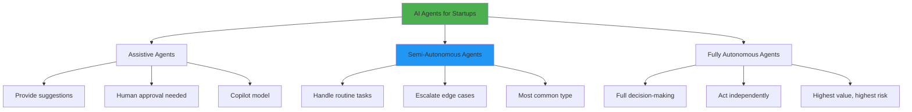
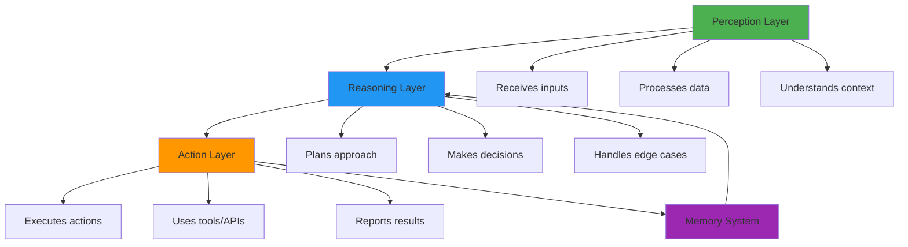
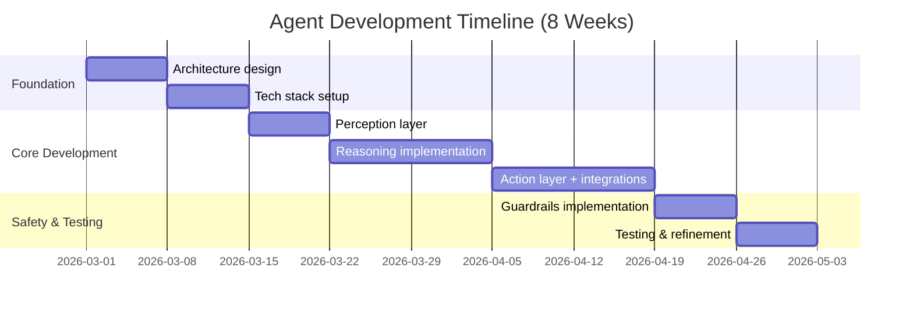
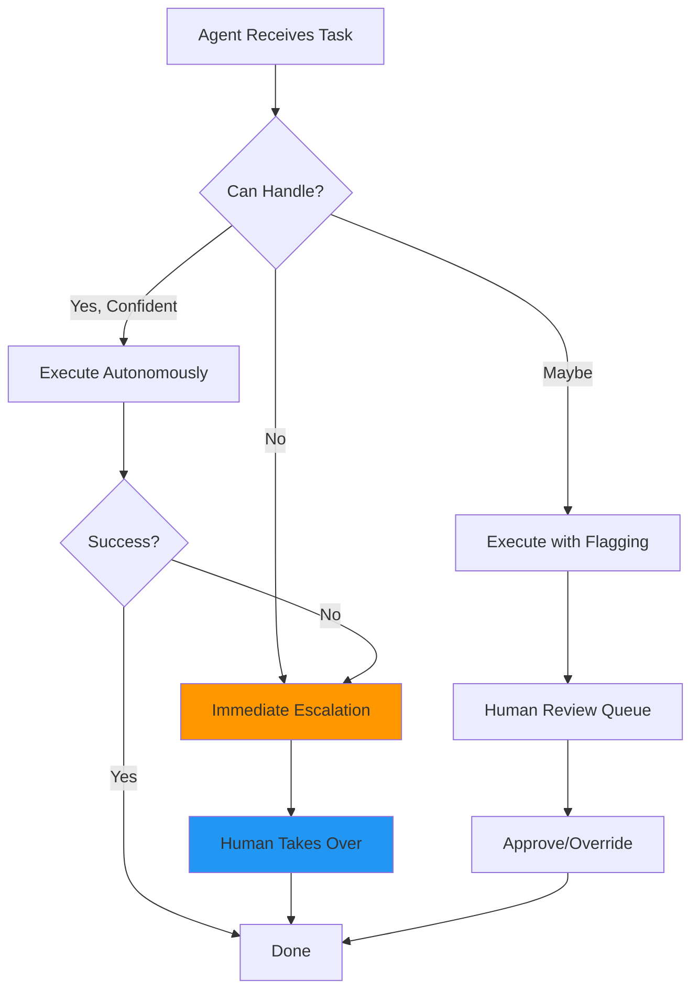

# Agentic AI for Startups in 2026: Complete Guide to Building Autonomous AI Systems

The shift is happening **right now**: AI is evolving from tools that respond to commands into **autonomous agents that take action**.

If 2024 was the year of ChatGPT and generative AI, 2025 was the year developers started experimenting with agents. 2026 is shaping up as the year when agentic AI shifts from experimentation to real ROI, measurable outcomes, and enterprise adoption.

For startups, this represents the most significant opportunity since the mobile revolution. But here's the challenge: **most founders don't understand what agentic AI actually is**, let alone how to build it for their business.

This guide cuts through the hype and shows you exactly how to build agentic AI systems that deliver real business value—without burning through your runway.

---

## What Is Agentic AI? (Simple Explanation)

**Agentic AI = AI that acts autonomously to achieve goals.**

Traditional AI (like ChatGPT) waits for your input, processes it, and returns a response. **Agentic AI doesn't wait**—it observes, plans, acts, and learns from results.

### The Core Difference

| Traditional AI (Generative) | Agentic AI (Autonomous) |
|----------------------------|------------------------|
| **Creates** content | **Does** tasks |
| Waits for prompts | Acts independently |
| Single interaction | Multi-step workflows |
| "What should I write?" | "Write it, send it, follow up" |
| ChatGPT, Claude | AI SDRs, coding agents, customer service bots |


**Think of it this way:** ChatGPT is like a consultant who gives advice. An AI agent is like an employee who executes the entire project.


### Real Example

**Traditional AI Workflow:**
```
1. You: "Write an email to leads who visited pricing page"
2. AI: [Generates email]
3. You: Copy email to Mailchimp
4. You: Segment audience
5. You: Schedule send
6. You: Set up follow-up
```

**Agentic AI Workflow:**
```
1. You: "Convert pricing page visitors into demos"
2. AI Agent: 
   - Identifies visitors from analytics
   - Personalizes email based on their behavior
   - Sends email via your CRM
   - Tracks opens and clicks
   - Sends follow-up to non-responders
   - Books demo calls automatically
   - Reports results to you
```

The agent handles the **entire workflow autonomously**.

---

## Why Agentic AI Matters for Startups in 2026

The market momentum is undeniable:

### Explosive Adoption Rates

<div class="comparison-grid">

| Metric | 2024 | 2025 | 2026 (Projected) |
|--------|------|------|------------------|
| **Companies using AI agents** | 8% | 23% | 40%+ |
| **Companies experimenting** | 15% | 39% | 55%+ |
| **Market size** | $5.2B | $18B | $45B+ |
| **Enterprise software with agents** | 5% | 15% | 33% |

</div>

According to Gartner, by 2029, Agentic AI will autonomously resolve 80% of common customer service issues without human intervention.

### Why Startups Are Winning with Agents

**1. Competitive Moat**
Many AI agent startups fail because they are thin wrappers around foundation models with no defensible moat. The solution is to build proprietary assets: domain-specific training data, workflow integrations, regulatory compliance certifications, or network effects.

**2. Speed of Execution**
Startups building agentic AI from day one can operate with 3-5x smaller teams while delivering enterprise-level capabilities.

**3. Capital Efficiency**
One AI agent can replace 2-3 full-time employees in specific workflows, dramatically reducing burn rate.

**4. Investor Interest**
Eight leading investors share how agentic AI is reshaping startups in 2026, with real ROI and measurable outcomes driving funding decisions.

---

## The 3 Types of AI Agents Startups Are Building



### Type 1: Assistive Agents (Copilots)

**What they do:** Augment human work with AI suggestions

**Autonomy level:** Low (human-in-the-loop)

**Examples:**
- GitHub Copilot for coding
- Grammarly for writing
- Design assistants in Figma

**Best for startups:**
- First-time AI builders
- Regulated industries
- High-stakes decisions

**Typical cost:** $20-50/user/month

---

### Type 2: Semi-Autonomous Agents

**What they do:** Execute defined workflows with human oversight for exceptions

**Autonomy level:** Medium (human-on-the-loop)

**Examples:**
- AI agents that handle customer service calls, troubleshooting, implementing solutions like issuing refunds, updating customer records, or managing orders and subscriptions
- Scheduling agents that book meetings
- Data entry agents

**Best for startups:**
- Most product use cases
- Customer service automation
- Sales and marketing workflows

**Typical cost:** $100-500/month base + usage

---

### Type 3: Fully Autonomous Agents

**What they do:** Operate independently to achieve objectives

**Autonomy level:** High (human-off-the-loop)

**Examples:**
- Autonomous SDR agents that handle the entire outbound sales workflow: prospecting, initial outreach, lead qualification, appointment setting, and follow-up nurturing
- Manufacturing coordination agents
- Financial trading agents

**Best for startups:**
- Proven workflows only
- Non-critical business functions
- Data-rich environments

**Typical cost:** $500-5K/month + custom development


**Reality Check:** Customers expect 100% autonomous operation, but most AI agents in 2026 still require human oversight for edge cases. Position the agent as augmentation, not replacement.


---

## Real Agentic AI Startups Raising Millions in 2026

Let's look at actual companies building agentic AI and the problems they're solving:

### Customer Service Agents

**Poly AI (London) - $204M raised**
Builds advanced conversational voice agents that handle customer interactions with natural, human-like dialogue, managing authentication, bookings, and payments.

**Key insight:** Voice is harder than text, but creates stronger moat.

---

### Sales & Revenue Agents

**Iris - Personal AI Agent**
Observes how you handle your day—replies, decisions, priorities—and prepares the next actions. Over 1,200 people downloaded in first month, 168 daily active users, 36,000+ actions taken.

**Key insight:** Behavior modeling creates personalization impossible with generic agents.

---

### Industry-Specific Agents

**Bravi - AI Operating System for Home Services**
Replaces the front office (calls, chats, follow-ups) with AI agents that never miss a lead, then layers internal AI copilot for products, pricing, and technical documentation.

**Key insight:** Vertical-specific agents with deep domain knowledge have higher barriers to entry.

---

### Developer Tools

**Canary - AI QA Engineer**
First AI QA engineer that reads source code directly to understand developer intent and catch broken user flows before production. Teams go from weeks of manual testing to 90%+ coverage in days.

**Key insight:** Agents that understand code (not just UI) provide exponentially better value.

---

### Financial Agents

**Meridian - Agentic Financial Modeling**
Raised $17 million at $100M valuation. Provides IDE-based approach to agentic financial modeling, condensing hours of work into 10 minutes while maintaining auditability.

**Key insight:** In regulated industries, auditability and determinism are as important as automation.

---

## The 10 Hottest Agentic AI Use Cases for Startups

Based on current adoption and ROI data:

### 1. Autonomous Customer Service

**What it does:**
AI agents resolve Tier-1 and Tier-2 issues across chat, email, and voice by integrating with CRMs, order systems, and ticketing tools.

**Business impact:**
- 60-80% ticket deflection
- $30-50K annual savings per support agent replaced
- 24/7 availability

**Best for:**
- SaaS products
- E-commerce
- Any business with repetitive support queries

**Implementation complexity:** Medium

---

### 2. Sales Development Representatives (SDRs)

**What it does:**
Handles prospecting, initial outreach, lead qualification, appointment setting, and follow-up nurturing through multi-channel campaigns across email, LinkedIn, and phone.

**Business impact:**
- 3-5x more outreach than human SDR
- $50-70K cost vs $80-120K for human SDR
- 24/7 operation

**Best for:**
- B2B SaaS
- Agencies
- High-velocity sales orgs

**Implementation complexity:** Medium-High

---

### 3. DevOps & IT Automation

**What it does:**
AI agents monitor device health, run fixes, resolve issues, and update tickets without human intervention. If a laptop overheats or VPN fails, agent diagnoses, patches, and notifies.

**Business impact:**
- 70% reduction in manual tickets
- Faster incident response
- Lower IT staffing needs

**Best for:**
- Growing tech companies
- Remote-first teams
- Companies with distributed infrastructure

**Implementation complexity:** High

---

### 4. Content & Marketing Automation

**What it does:**
Multi-agent system that researches topics, generates content, optimizes for SEO, schedules publishing, and distributes across channels.

**Business impact:**
- 10x content production
- Consistent brand voice
- SEO optimization at scale

**Best for:**
- Content-heavy businesses
- Marketing agencies
- Media companies

**Implementation complexity:** Low-Medium

---

### 5. Data Analysis & Reporting

**What it does:**
Agents break down queries, conduct data analysis on SQL data, build charts and graphs, and translate AI insights into user-friendly structured reports.

**Business impact:**
- Hours saved per report
- Democratized data access
- Faster decision-making

**Best for:**
- Data-driven companies
- BI teams
- Executive dashboards

**Implementation complexity:** Medium-High

---

### 6. Financial Operations

**What it does:**
Automates invoice processing, expense categorization, reconciliation, and financial reporting.

**Business impact:**
- 90% faster close cycles
- Reduced errors
- Better cash flow visibility

**Best for:**
- High-transaction businesses
- Finance teams
- Accounting firms

**Implementation complexity:** Medium

---

### 7. Recruitment & HR

**What it does:**
Jack and Jill AI ($20M raised): Jack interacts with job seekers to understand skills and goals, while Jill works with employers to learn needs and surface ideal matches.

**Business impact:**
- 50% faster time-to-hire
- Better candidate matching
- Reduced recruiter workload

**Best for:**
- High-growth startups
- Recruiting agencies
- Large hiring volumes

**Implementation complexity:** Medium

---

### 8. Supply Chain Management

**What it does:**
Reframe deploys AI agents to manage overseas hardware manufacturing, understanding build matrices, coordinating waterfall schedules with suppliers, and negotiating pricing.

**Business impact:**
- 30% cost reduction
- Better supplier coordination
- Reduced delays

**Best for:**
- Hardware startups
- Manufacturing companies
- Supply chain ops

**Implementation complexity:** High

---

### 9. Legal & Compliance

**What it does:**
Gradient Labs: Autonomous conversational AI for regulated industries like financial services, handling complex support tasks end-to-end while adhering to strict compliance standards.

**Business impact:**
- Faster contract review
- Compliance automation
- Risk identification

**Best for:**
- Fintech
- Legal tech
- Regulated industries

**Implementation complexity:** Very High

---

### 10. Code Generation & Testing

**What it does:**
AI agents streamline CI/CD pipelines by reviewing code, running automated tests, deploying releases, and rolling back faulty builds.

**Business impact:**
- 70% faster testing cycles
- Fewer bugs in production
- Developer productivity gains

**Best for:**
- Software companies
- Developer tools
- Technical products

**Implementation complexity:** High

---

## How to Build Agentic AI: 5-Step Framework

### Step 1: Choose the Right Use Case

**Use this decision matrix:**

<div class="comparison-grid">

| Factor | Score This (1-5) | Your Score |
|--------|------------------|------------|
| **Task is repetitive** | How often is this done? | ___ |
| **Clear success criteria** | Can you measure outcomes? | ___ |
| **Structured workflows** | Is process documented? | ___ |
| **Data availability** | Do you have training data? | ___ |
| **Business impact** | High ROI potential? | ___ |
| **Risk tolerance** | Low consequence if wrong? | ___ |

**Scoring:**
- 25-30: Excellent candidate for agentic AI
- 18-24: Good candidate, needs some prep
- 12-17: Possible but challenging
- Below 12: Not ready for agents yet

</div>



**Example: Automated Lead Qualification**

✅ Repetitive (every lead goes through same process)
✅ Clear criteria (qualified vs not qualified)
✅ Structured workflow (defined scoring)
✅ Data available (historical lead data)
✅ High impact (faster sales cycle)
✅ Low risk (human reviews final decision)

**Score: 28/30** - Excellent first project



**Example: Strategic Business Decisions**

❌ Not repetitive (each decision is unique)
❌ Unclear criteria (subjective judgment)
❌ Unstructured (depends on context)
❌ Limited data (few past decisions)
❌ High impact (yes, but...)
❌ High risk (wrong decision = major loss)

**Score: 8/30** - Not suitable for agents



---

### Step 2: Design the Agent Architecture

**Three core components every agent needs:**



**1. Perception Layer:**
- What data does the agent need?
- How does it receive inputs?
- What triggers the agent?

**2. Reasoning Layer:**
- What LLM will power decisions?
- What prompts/instructions guide it?
- How does it handle uncertainty?

**3. Action Layer:**
- What tools/APIs can it access?
- What actions can it take?
- What are the safety limits?

**4. Memory System:**
- What does it need to remember?
- How long should memory persist?
- How does it learn from past actions?

---

### Step 3: Set Up Guardrails & Safety

Codify guardrails: Set strict boundaries on budgets, scopes, allow/deny lists, rate limits, and time windows. Guardrails are the backbone of safe autonomy.

**Critical safety measures:**

<div class="checklist">

**Authorization Limits:**
- [ ] Maximum spend per action ($100, $1000, etc.)
- [ ] Approval required above threshold
- [ ] Time-based restrictions (business hours only)
- [ ] User-level permissions

**Action Boundaries:**
- [ ] Allowed actions whitelist
- [ ] Forbidden actions blacklist
- [ ] External service restrictions
- [ ] Data access controls

**Monitoring & Alerts:**
- [ ] Real-time action logging
- [ ] Anomaly detection
- [ ] Error rate thresholds
- [ ] Human review triggers

**Escalation Rules:**
- [ ] When to involve humans
- [ ] How to hand off context
- [ ] Escalation response SLAs

</div>

**Safety Architecture Example:**

```javascript
const agentGuardrails = {
  maxBudget: 500, // USD
  allowedHours: { start: 9, end: 17 }, // Business hours
  allowedActions: [
    'send_email',
    'create_task',
    'update_crm'
  ],
  forbiddenActions: [
    'delete_data',
    'modify_pricing',
    'access_financial_accounts'
  ],
  escalationTriggers: {
    uncertainty: 0.7, // Escalate if confidence < 70%
    highValue: 1000, // Escalate if decision value > $1K
    sensitiveData: true // Always escalate if PII involved
  }
};
```


**Critical Mistake:** Deploying agents without proper guardrails. Organizations are deploying agents faster than they can secure them, creating a governance gap. Always implement limits before going live.


---

### Step 4: Build & Test Your Agent

**Technology stack options:**

| Component | Option 1 (Easiest) | Option 2 (Balanced) | Option 3 (Advanced) |
|-----------|-------------------|---------------------|-------------------|
| **LLM** | OpenAI GPT-4 API | Claude API | Self-hosted Llama |
| **Framework** | LangChain | CrewAI | Custom Python |
| **Memory** | Pinecone | Weaviate | PostgreSQL + pgvector |
| **Orchestration** | n8n | Temporal | Custom backend |
| **Cost** | $$$ | $$ | $ (+ engineering time) |
| **Time to MVP** | 2-4 weeks | 4-8 weeks | 8-16 weeks |

**Development timeline:**



**Testing checklist:**

<div class="checklist">

**Functional Testing:**
- [ ] Agent completes happy path successfully
- [ ] Handles expected edge cases
- [ ] Escalates appropriately
- [ ] Memory persists correctly

**Safety Testing:**
- [ ] Respects budget limits
- [ ] Stays within allowed actions
- [ ] Escalates high-risk decisions
- [ ] Fails gracefully

**Performance Testing:**
- [ ] Response time < 5 seconds
- [ ] Accuracy > 85%
- [ ] Cost per action within budget
- [ ] Handles concurrent requests

**User Acceptance:**
- [ ] 10+ real users test it
- [ ] Feedback collected
- [ ] Success rate measured
- [ ] Improvements identified

</div>

---

### Step 5: Deploy & Monitor

**Deployment stages:**

| Stage | Users | Duration | Goal |
|-------|-------|----------|------|
| **Alpha** | Internal team (5-10) | 1-2 weeks | Find breaking bugs |
| **Beta** | Friendly customers (20-50) | 2-4 weeks | Validate use case |
| **Limited** | Segment of users (100-500) | 4-8 weeks | Prove ROI |
| **General** | All users | Ongoing | Scale & optimize |

**Monitoring dashboard essentials:**

```
Key Metrics to Track:

Performance:
├─ Actions completed successfully: 847/1000 (84.7%)
├─ Average completion time: 3.2 seconds
├─ Escalations to humans: 153 (15.3%)
└─ User satisfaction: 4.2/5.0

Business Impact:
├─ Cost per action: $0.42
├─ Time saved per user: 2.3 hours/week
├─ ROI: 340%
└─ Payback period: 2.1 months

Safety:
├─ Safety violations: 0
├─ Budget overruns: 0
├─ Unauthorized actions: 0
└─ Escalations responded: 153/153 (100%)
```


**Pro Tip:** Start with read-only access, move to suggestion-only mode, then allow constrained actions, and gradually expand to broader autonomy. This staged rollout minimizes risk.


---

## Agentic AI Tech Stack for Startups

### Complete Technology Comparison

**LLM Providers:**

<div class="comparison-grid">

| Provider | Best For | Pricing | Pros | Cons |
|----------|----------|---------|------|------|
| **OpenAI GPT-4** | General agents | $0.01-0.06/1K tokens | Best performance, largest ecosystem | Expensive at scale |
| **Anthropic Claude** | Long-context tasks | $0.008-0.024/1K tokens | 200K context, safety-focused | Slightly slower |
| **Google Gemini** | Multimodal agents | $0.001-0.002/1K tokens | Best pricing, good quality | Newer, less proven |
| **Groq** | Speed-critical | $0.27-1.00/1M tokens | 10x faster inference | Limited model selection |
| **Llama 3 (self-hosted)** | Cost-sensitive | Infrastructure costs | Full control, no per-token cost | Requires ML expertise |

</div>

**Agent Frameworks:**

| Framework | Language | Best For | Learning Curve | GitHub Stars |
|-----------|----------|----------|----------------|--------------|
| **LangChain** | Python/JS | General purpose | Medium | 88K+ |
| **CrewAI** | Python | Multi-agent teams | Low-Medium | 15K+ |
| **AutoGen** | Python | Conversational agents | Medium | 28K+ |
| **LlamaIndex** | Python | RAG + data agents | Medium | 32K+ |
| **Vercel AI SDK** | JavaScript | Web apps | Low | 8K+ |

**Vector Databases:**

| Database | Type | Pricing | Best For | Standout Feature |
|----------|------|---------|----------|------------------|
| **Pinecone** | Managed | $70+/mo | Production | Easiest setup |
| **Weaviate** | Open source/Cloud | Free - $250+/mo | Flexibility | Hybrid search |
| **Qdrant** | Open source/Cloud | Free - $100+/mo | Performance | Rust-based speed |
| **Chroma** | Open source | Free | Development | Embedded mode |
| **pgvector** | Postgres extension | DB cost only | Postgres users | Familiar SQL |

---

## Cost Breakdown: Building Agentic AI

### Development Costs

<div class="cost-comparison">

| Budget Level | Timeline | What You Get | Best For |
|--------------|----------|--------------|----------|
| **$15K-30K** | 4-6 weeks | Single agent, basic workflows | First agent MVP |
| **$30K-60K** | 8-12 weeks | Multi-agent system, integrations | Production-ready agent |
| **$60K-150K** | 3-6 months | Enterprise agent platform | Full automation suite |
| **$150K+** | 6-12 months | Custom infrastructure, training | Complex multi-agent systems |

</div>

### Operating Costs (Monthly)

**Example: Customer Service Agent for 1,000 tickets/month**

| Component | Cost Range | Notes |
|-----------|-----------|-------|
| **LLM API calls** | $200-800 | Depends on model choice |
| **Vector database** | $50-200 | Scales with data volume |
| **Infrastructure** | $100-300 | Servers, hosting, monitoring |
| **Integration APIs** | $50-200 | CRM, tools, services |
| **Monitoring tools** | $50-100 | Logging, analytics |
| **Total** | **$450-1,600/month** | vs $4K-6K for human agent |

**Cost optimization strategies:**

1. **Aggressive caching** - Reduce API calls by 60-80%
2. **Smart routing** - Use cheaper models for simple tasks
3. **Batch processing** - Process multiple requests together
4. **Prompt optimization** - Shorter prompts = lower costs
5. **Model selection** - Don't always use GPT-4

---

## Common Agentic AI Mistakes (And How to Avoid Them)

### Mistake #1: Building Without Clear ROI

**What happens:**
Team spends 3 months building an agent that saves 30 minutes/week. Cost of development: $50K. Annual savings: $2K.

**The fix:**
Calculate ROI before building:
```
ROI Formula:
(Annual Savings - Annual Cost) / Development Cost = ROI

Good ROI: 200%+ in year 1
Acceptable: 100-200% in year 1
Poor: <100% in year 1
```

**ROI Calculation Example:**

| Factor | Value |
|--------|-------|
| Human cost replaced | $50K/year |
| Agent operating cost | $15K/year |
| Annual savings | $35K |
| Development cost | $40K |
| Year 1 ROI | -$5K (break-even month 14) |
| Year 2 ROI | $30K (75% return) |
| Year 3 ROI | $65K (163% return) |


**Rule of Thumb:** Your agent should save at least 2x its development cost in the first year to be worth building.


---

### Mistake #2: Over-Promising Autonomy

**What happens:**
Customers expect 100% autonomous operation, but most AI agents in 2026 still require human oversight for edge cases. Customers feel deceived, churn increases.

**The fix:**

**Be transparent about limitations:**

| Agent Capability | Claim This | Not This |
|-----------------|------------|----------|
| **Success Rate** | "Handles 85% of tickets autonomously" | "Fully autonomous support" |
| **Accuracy** | "92% accuracy, human review for edge cases" | "Perfect decisions every time" |
| **Scope** | "Automates routine inquiries" | "Replaces entire support team" |
| **Timeline** | "2-3 months to full deployment" | "Live in 2 weeks" |

---

### Mistake #3: Ignoring Human Handoff

**What happens:**
Agent gets stuck, customer waits indefinitely, terrible experience.

**The fix:**

**Human-in-the-Loop Architecture:**



**Escalation triggers:**

- Confidence score < 70%
- Task value > defined threshold
- User explicitly requests human
- Agent encounters error
- Timeout reached (30 seconds with no solution)

---

### Mistake #4: No Agent Observability

**What happens:**
Agent fails silently, issues compound, customers complain before you know there's a problem.

**The fix:**

**Build comprehensive monitoring:**

```javascript
// Log every agent action
const logAgentAction = async (action) => {
  await monitoring.log({
    timestamp: new Date(),
    agentId: 'customer-service-agent-1',
    action: action.type,
    input: action.input,
    output: action.output,
    confidence: action.confidence,
    cost: action.apiCost,
    duration: action.durationMs,
    success: action.success,
    escalated: action.escalated,
    userSatisfaction: action.feedback
  });
  
  // Alert on issues
  if (!action.success || action.confidence < 0.7) {
    await alertTeam({
      severity: 'warning',
      message: `Agent ${action.type} failed or low confidence`,
      data: action
    });
  }
};
```

**Monitoring dashboard must-haves:**

- ✅ Real-time action feed
- ✅ Success/failure rates
- ✅ Average confidence scores
- ✅ Cost per action trends
- ✅ User satisfaction ratings
- ✅ Escalation patterns
- ✅ Performance over time

---

### Mistake #5: Building Alone Without Domain Data

**What happens:**
Generic agent performs poorly because it lacks domain-specific knowledge.

**The fix:**

**Create domain-specific training:**

| Data Type | How to Collect | Impact on Performance |
|-----------|---------------|----------------------|
| **Historical decisions** | Past tickets, emails, actions | +40% accuracy |
| **Documentation** | FAQs, playbooks, guidelines | +30% accuracy |
| **Expert feedback** | Human corrections to agent | +25% accuracy |
| **User interactions** | Conversations, outcomes | +20% accuracy |

**Example: Customer Service Agent Training**

```
Generic Agent Knowledge:
"Customer wants refund" → Generic refund policy response

Domain-Specific Agent Knowledge:
"Customer wants refund" → 
  - Check purchase date (within 30 days?)
  - Check product type (refundable?)
  - Check customer history (frequent returner?)
  - Check order value (requires approval?)
  - Execute appropriate action with context
```

---

## The Future of Agentic AI for Startups

### What's Coming in 2026-2027

**Trend #1: Multi-Agent Coordination**

Instead of single agents, systems with **specialized agents that collaborate**:

```
Sales Agent + Marketing Agent + Support Agent
      ↓              ↓              ↓
    Orchestrator Agent (coordinates all)
```

**Trend #2: Agentic Browsers**

Tools like Perplexity's Comet, Browser Company's Dia, OpenAI's GPT Atlas reframed the browser as an active participant rather than passive interface.

**Your agent can:**
- Research competitors automatically
- Fill out forms on your behalf
- Book flights and hotels
- Manage your calendar across sites

**Trend #3: Smaller, Faster, Cheaper Models**

On-device models cut cloud costs by 70%, with Qualcomm NPUs hitting 45 TOPS.

**Impact for startups:**
- Run agents on user devices
- Zero API costs
- Better privacy
- Offline functionality

**Trend #4: Agent Marketplaces**

Soon you'll be able to:
1. Buy pre-built agents for common tasks
2. Customize to your workflow
3. Deploy in minutes

Like Shopify apps, but for AI agents.

---

## Getting Started: Your First Agentic AI Project

### 30-Day Action Plan

**Week 1: Research & Planning**

<div class="checklist">

- [ ] Identify 3 potential use cases
- [ ] Calculate ROI for each
- [ ] Choose highest-impact use case
- [ ] Map current workflow
- [ ] Define success metrics

</div>

**Week 2: Design & Prototype**

<div class="checklist">

- [ ] Design agent architecture
- [ ] Choose tech stack
- [ ] Set up development environment
- [ ] Build basic prototype
- [ ] Test with dummy data

</div>

**Week 3: Development & Integration**

<div class="checklist">

- [ ] Implement core logic
- [ ] Add guardrails
- [ ] Integrate with existing tools
- [ ] Build monitoring
- [ ] Internal testing

</div>

**Week 4: Testing & Launch**

<div class="checklist">

- [ ] User acceptance testing
- [ ] Fix critical issues
- [ ] Create documentation
- [ ] Soft launch to 10 users
- [ ] Collect feedback

</div>

---

## Build vs Buy: Should You Build or Use a Platform?

### Decision Matrix

| Factor | Build Custom | Use Platform | Hybrid |
|--------|--------------|--------------|--------|
| **Time to Launch** | 2-6 months | 2-4 weeks | 1-3 months |
| **Cost (Year 1)** | $50K-200K | $10K-50K | $30K-100K |
| **Customization** | ✅ Full control | ⚠️ Limited | ✅ Good |
| **Maintenance** | ❌ You handle | ✅ Provider handles | 🟡 Shared |
| **Expertise Needed** | High | Low | Medium |
| **Best For** | Unique workflows | Standard use cases | Complex + standard |

### When to Build Custom

✅ Highly specialized domain
✅ Unique competitive advantage
✅ Have ML/AI engineering team
✅ Budget > $100K
✅ Timeline > 3 months acceptable

### When to Use Platform

✅ Standard use cases (support, sales, etc.)
✅ Need fast deployment
✅ Limited AI expertise
✅ Budget < $50K
✅ Want managed solution

### Recommended Platforms for Startups

**For Customer Service:**
- Kore.ai - Enterprise-grade orchestration
- Dialpad AI - Voice + text agents
- Ada - Customer service specialists

**For Sales:**
- Warmly - Agentic SDR platform
- Clay - Data enrichment agents
- Apollo - Outbound automation

**For Development:**
- LangChain - General framework
- CrewAI - Multi-agent teams
- n8n - No-code automation

---

## Frequently Asked Questions

### What's the difference between AI agents and AI chatbots?

**Chatbots:** Respond to user input, one message at a time.
**Agents:** Autonomously complete multi-step tasks to achieve goals.

Example: A chatbot answers "How do I reset my password?" An agent resets the password, emails you confirmation, and updates your security settings.

---

### How much does it cost to build an agentic AI system?

**Simple agent:** $15K-30K (4-6 weeks)
**Production agent:** $30K-60K (8-12 weeks)
**Complex multi-agent:** $60K-150K+ (3-6 months)

Plus $500-2K/month in operating costs.

---

### Do I need a large team to build AI agents?

No. Many successful agent startups start with 2-3 people:
- 1 founder/PM (defines workflows)
- 1-2 engineers (builds the agent)

Larger teams (5-10) can build more sophisticated multi-agent systems.

---

### What's the ROI of agentic AI?

Typical ROI ranges:
- Customer service agents: 200-400% annual ROI
- Sales agents: 150-300% annual ROI
- Operations agents: 250-500% annual ROI

Break-even usually occurs within 6-18 months.

---

### Is agentic AI safe for my business?

Yes, **if implemented with proper guardrails:**
- Action limits
- Budget caps
- Human escalation rules
- Comprehensive monitoring
- Regular audits

Leading organizations implement "bounded autonomy" architectures with clear operational limits, escalation paths to humans, and comprehensive audit trails.

---

### What industries benefit most from agentic AI?

**Top 5 industries:**
1. **Software/SaaS** - Customer support, sales, DevOps
2. **Financial Services** - Compliance, analysis, customer service
3. **Healthcare** - Scheduling, triage, administrative tasks
4. **E-commerce** - Customer service, inventory, recommendations
5. **Professional Services** - Document processing, scheduling, billing

---

## Work With Sainam Technology

At **[Sainam Technology](https://sainam.tech)**, we help startups build production-ready agentic AI systems that deliver real business value.

### Our Agentic AI Services

**🤖 Custom AI Agent Development**
We build domain-specific agents tailored to your exact workflows and business logic.

**What you get:**
- Requirements analysis & ROI modeling
- Agent architecture design
- Full-stack development
- Integration with your existing tools
- Guardrails & safety implementation
- Monitoring & analytics dashboard
- 8-12 week delivery timeline

**Investment:** $40K-80K

**Sainam Technology**
Building AI-first products for startups
🌐 Website: https://sainam.tech


Author-SUBHANSU SATYAPRAGNYA
---