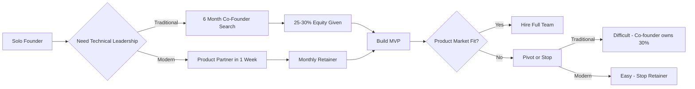
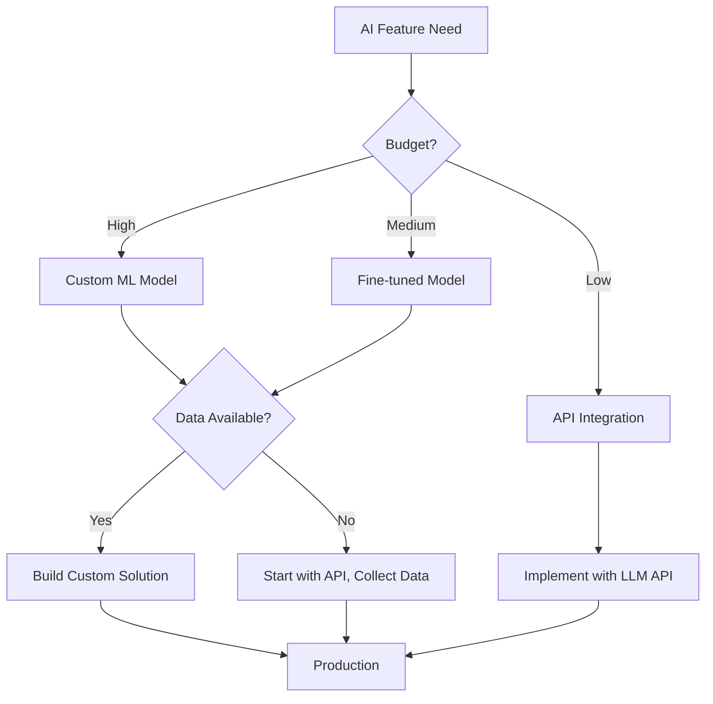
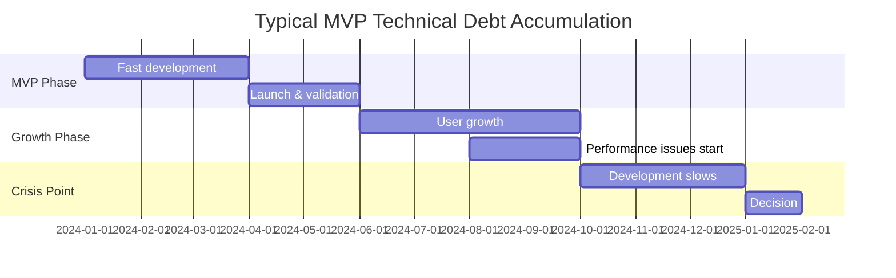
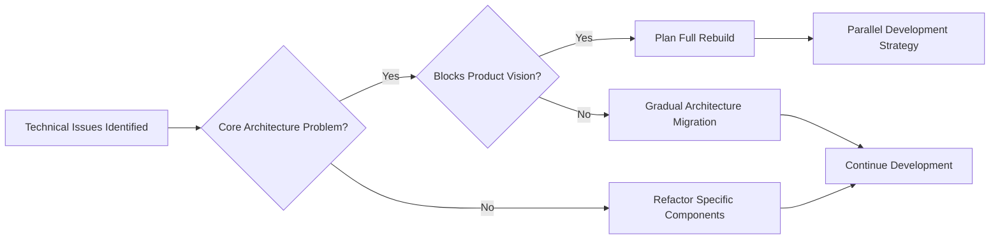
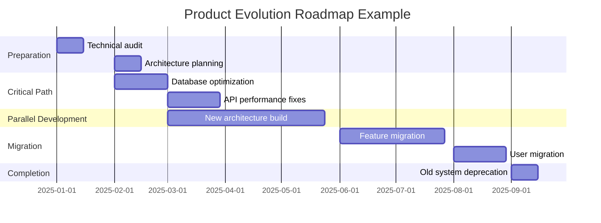
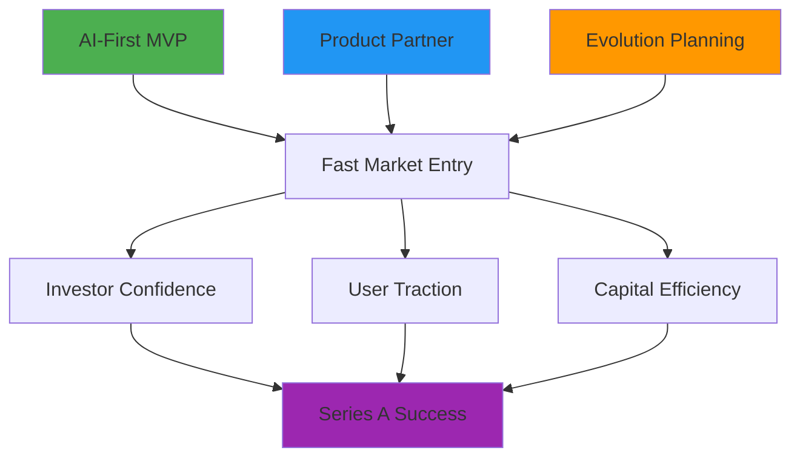
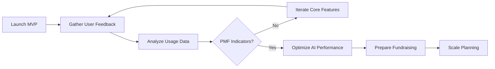
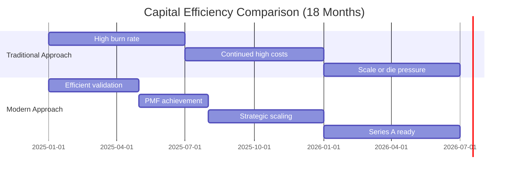
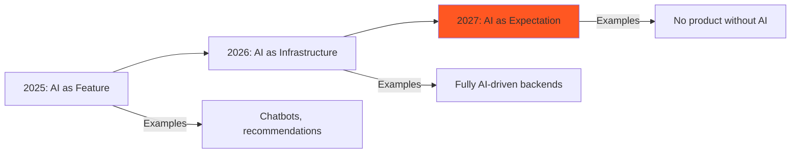
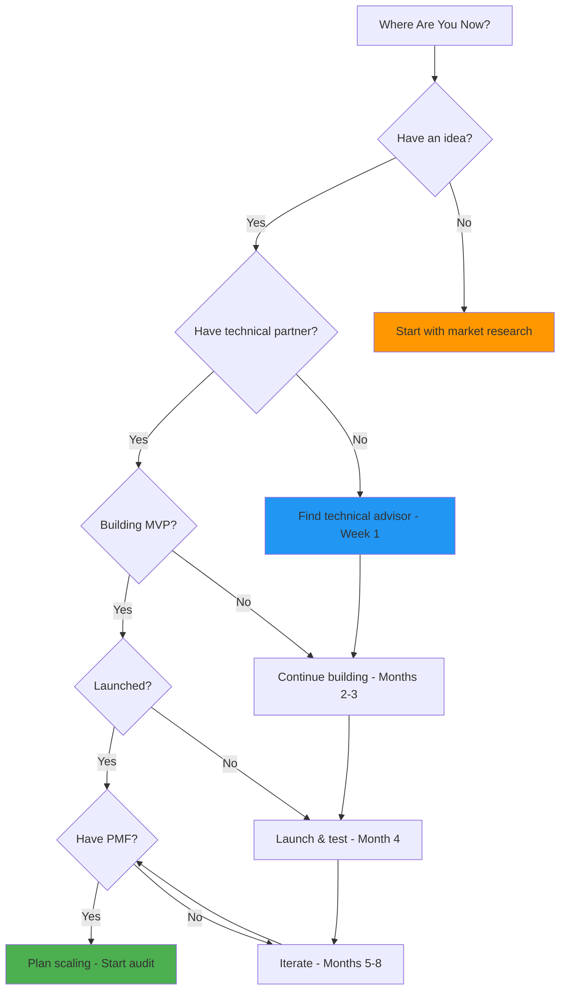


**Quick Read:** This guide combines three rising startup trends: AI-first MVP development, technical co-founder alternatives, and post-PMF product evolution. Perfect for founders planning their next move.


The traditional startup playbook is broken.

You don't need to spend 6 months searching for the "perfect" technical co-founder. You don't need to give away 30% equity before validating your idea. And you definitely don't need to build your MVP the same way startups did in 2015.

Today's most successful founders are taking a different path: **AI-first MVPs built with experienced product partners** who provide CTO-level expertise without the long-term commitment.

This shift isn't just about speed—it's about **building smarter from day one**.

---

## Why Technical Co-Founder Alternatives Are Rising Fast

The "find a technical co-founder" advice has dominated startup circles for years. But the reality for solo founders has changed dramatically.

### The Traditional Co-Founder Problem

Here's what most founders face when searching for a technical co-founder:

| Challenge | Time Impact | Risk Level |
|-----------|-------------|------------|
| Finding the right match | 3-6 months | High |
| Equity negotiation | 2-4 weeks | Medium |
| Vision alignment | Ongoing | High |
| Commitment flexibility | None | Very High |
| Exit if misaligned | 6-12+ months | Severe |

### The Modern Alternative: Strategic Product Partners

Smart founders are now working with **retainer-based technical leadership**—experienced CTOs and product leaders who guide architecture, development, and scaling without requiring founder equity.



**Pros:**
- Full-time commitment
- Shared ownership mindset
- Long-term partnership

**Cons:**
- 25-30% equity given
- 3-6 months to find
- High risk if misaligned
- Difficult to exit



**Pros:**
- Immediate start
- Flexible engagement
- Zero equity given
- Easy to adjust scope

**Cons:**
- Monthly retainer cost
- Not full-time dedicated
- Requires clear communication



**Why this model works:**

Solo founders get immediate access to senior technical expertise without the commitment pressure. You validate your idea faster, iterate more efficiently, and retain control of your cap table during the crucial early stages.

### Real-World Applications



**Engagement models:**
- Monthly retainer for ongoing CTO advisory ($3K-8K/month)
- Project-based MVP development with architecture guidance ($30K-60K)
- Part-time technical leadership during pre-seed/seed stages
- Code reviews and technical due diligence support

> **Community Insight:** This approach is particularly powerful in founder communities like Y Combinator, Pioneer, and OnDeck, where solo founders need technical validation quickly to compete for funding.

---

## AI MVP Development: From "Nice-to-Have" to Core Requirement

Here's what's changed: **AI is no longer an add-on feature**. It's becoming the foundation of how products are built.

### Search Trend Analysis

| Keyword | Trend | Search Intent | Year-over-Year Growth |
|---------|-------|---------------|----------------------|
| AI MVP development | ⬆️ Rising | Research + Buying | +340% |
| AI integration services | ⬆️ Rising | Buying | +215% |
| Build AI product | ⬆️ Rising | Research | +180% |
| AI-first startup | ⬆️ Rising | Research | +156% |


**Founder Insight:** Investors increasingly favor products with AI differentiation. A traditional CRUD app without intelligent features faces harder questions during fundraising rounds in 2025.


### What AI-First MVP Development Actually Means

**Practical AI integrations for MVPs:**

<div class="comparison-grid">

| Feature Type | Traditional Approach | AI-First Approach | User Impact |
|--------------|---------------------|-------------------|-------------|
| Search | Keyword matching | Semantic search with embeddings | 10x better results |
| Content | Manual creation | AI-assisted generation | 50x faster |
| Recommendations | Rule-based | Personalized ML models | 5x engagement |
| Support | FAQ pages | Conversational AI assistant | 24/7 availability |
| Analytics | Static reports | Predictive insights | Proactive decisions |

</div>

### Technical Architecture Decision Matrix



### AI Stack Comparison for MVPs

| Approach | Cost/Month | Setup Time | Flexibility | Best For |
|----------|-----------|------------|-------------|----------|
| OpenAI API | $50-500 | 1-2 days | High | Most MVPs |
| Anthropic Claude | $60-600 | 1-2 days | High | Complex reasoning |
| Open Source (Llama) | $100-1000 | 1-2 weeks | Very High | Cost-sensitive |
| Custom Fine-tuning | $1000-5000 | 4-8 weeks | Medium | Specialized domains |
| Build from Scratch | $10000+ | 3-6 months | Low | Not recommended for MVPs |


**Cost Alert:** LLM API calls add up fast. A product with 1,000 daily active users making 10 AI requests each = 300K calls/month. At $0.002/call = $600/month minimum. Implement caching, prompt optimization, and cost monitoring from day one.


### Real Business Applications

**SEO Strategy:**
Create a comprehensive blog series: *"Building AI-First MVPs"* covering:
- Week 1: Model selection guide
- Week 2: Cost optimization strategies  
- Week 3: Prompt engineering best practices
- Week 4: Production deployment checklist

**Product Offering:**
```
┌─────────────────────────────────────┐
│   MVP Development Tiers             │
├─────────────────────────────────────┤
│ Basic:  No AI           ($30K)      │
│ Standard: API AI        ($45K)      │ ← Position this as default
│ Advanced: Custom AI     ($75K)      │
└─────────────────────────────────────┘
```

---

## MVP to Series A: When (and How) to Rebuild Your Product

Your MVP got traction. Users are signing up. Investors are interested.

Now the hard question: **Is your MVP architecture ready to scale?**

### The Technical Debt Timeline



### Signs You've Outgrown Your MVP

#### Performance Red Flags

| Metric | MVP Acceptable | Scale Required | Critical |
|--------|---------------|----------------|----------|
| API Response Time | <1s | <300ms | <100ms |
| Database Queries | Any | Optimized | Indexed + Cached |
| Page Load | <3s | <1.5s | <1s |
| Concurrent Users | 100 | 1,000 | 10,000+ |
| Monthly AWS Cost | $100-500 | $500-2000 | Optimized architecture needed |

#### Development Velocity Indicators

<div class="metrics-grid">

| Phase | Feature Delivery | Bug Rate | Team Morale | Action Needed |
|-------|-----------------|----------|-------------|---------------|
| **Healthy MVP** | 2-3 days | Low | High | Keep building |
| **Warning Signs** | 1-2 weeks | Medium | Declining | Plan refactor |
| **Critical** | 3-4 weeks | High | Low | Rebuild now |
| **Crisis** | Months | Severe | Very Low | Already too late |

</div>

### When to Rebuild vs. Refactor



**Decision Framework:**

| Factor | Refactor | Rebuild |
|--------|----------|---------|
| **Scope** | 1-3 components | Entire architecture |
| **Time** | 2-6 weeks | 3-6 months |
| **Risk** | Low | Medium-High |
| **Cost** | $10K-30K | $80K-200K |
| **Business Impact** | Minimal | Significant planning needed |


**Critical Mistake:** Don't rebuild too early (before PMF) or too late (after complete collapse). Watch for the warning signs and act when development velocity drops by 50%+.


### The Smart Rebuild Strategy

#### Phase 1: Product Audit (Weeks 1-2)

**Assessment Checklist:**

- [ ] Performance profiling across all endpoints
- [ ] Database query analysis and optimization opportunities
- [ ] Architecture scalability assessment
- [ ] Code quality metrics and technical debt quantification
- [ ] Security vulnerability scanning
- [ ] Infrastructure cost analysis
- [ ] Third-party dependency audit

**Typical Audit Findings:**

| Issue Category | Frequency | Avg. Fix Cost | Priority |
|---------------|-----------|---------------|----------|
| Database optimization | 85% | $5K-15K | High |
| API performance | 70% | $8K-20K | High |
| Security gaps | 60% | $10K-25K | Critical |
| Infrastructure waste | 50% | $2K-8K/month saved | Medium |
| Code quality | 90% | $15K-40K | Medium |

#### Phase 2: Strategic Roadmap (Weeks 3-4)



**Prioritization Matrix:**

<div class="priority-matrix">

| Impact → | Low | Medium | High |
|----------|-----|--------|------|
| **High Effort** | Defer | Plan for Q3-Q4 | Schedule carefully |
| **Medium Effort** | Low priority | Do after quick wins | Do next |
| **Low Effort** | Maybe never | Do soon | **Do now** |

</div>

---

## How These Trends Connect: The Modern Startup Stack

The most successful startups in 2025 are combining all three approaches:

### The Compound Benefits Model



### Timeline Comparison: Traditional vs. Modern Approach

| Milestone | Traditional Path | Modern Approach | Time Saved |
|-----------|-----------------|-----------------|------------|
| **Find Technical Leadership** | 3-6 months co-founder search | 1 week product partner | 2-5 months |
| **Define Architecture** | 2-4 weeks (if co-founder found) | 1-2 weeks (advisor-led) | 1-2 weeks |
| **Build MVP** | 4-6 months | 2-3 months (AI-enhanced tools) | 2-3 months |
| **First User Testing** | Month 7-12 | Month 3-4 | 4-8 months |
| **Iterate to PMF** | Month 12-18 | Month 5-8 | 7-10 months |
| **Prepare for Scale** | Month 18+ | Built-in from start | N/A |
| **Total to Series A** | 24-30 months | 12-18 months | **12+ months** |

---

## Practical Implementation Guide

### For Solo Founders Building Your First MVP

**Month 1: Foundation Phase**

<div class="checklist">

**Week 1-2: Planning**
- [ ] Document core product vision (1-page brief)
- [ ] Identify AI enhancement opportunities
- [ ] Research 3-5 technical advisors
- [ ] Create basic feature prioritization matrix

**Week 3-4: Engagement**
- [ ] Select and engage technical advisor ($3K-8K/month)
- [ ] Define MVP scope with AI integration points
- [ ] Choose AI architecture (API vs. custom)
- [ ] Set up project management and communication tools

</div>

**Months 2-3: MVP Development**

| Week | Focus Area | Deliverables | AI Integration |
|------|-----------|--------------|----------------|
| 1-2 | Core authentication & database | User system, basic CRUD | None yet |
| 3-4 | Primary feature development | Main user workflow | Plan integration points |
| 5-6 | AI feature integration | Smart features live | LLM API integration |
| 7-8 | Testing & optimization | Bug fixes, performance tuning | Cost optimization |
| 9-10 | Analytics & monitoring | Full observability | AI usage tracking |
| 11-12 | Launch preparation | Production deployment | Load testing |

**Months 4-6: Validation & Iteration**



### For Post-PMF Startups Preparing to Scale

**Quarter 1: Assessment**

**Technical Health Scorecard:**

| Area | Score (1-10) | Priority | Estimated Fix Cost |
|------|-------------|----------|-------------------|
| Database performance | _____ | _____ | $______ |
| API response times | _____ | _____ | $______ |
| Code quality | _____ | _____ | $______ |
| Security posture | _____ | _____ | $______ |
| Infrastructure efficiency | _____ | _____ | $______ |
| Team velocity | _____ | _____ | $______ |
| **Total Assessment** | **_____** | | **$______** |

*Score Guide: 1-3 (Critical), 4-6 (Needs attention), 7-8 (Good), 9-10 (Excellent)*

---

## Cost Comparison: Traditional vs. Modern Approach

### Total First Year Investment Analysis

<div class="cost-comparison">

**Traditional Path:**

| Item | Cost | Equity | Notes |
|------|------|--------|-------|
| Co-founder search (opportunity cost) | $0 cash | 25-30% | 3-6 months lost |
| Full-time CTO salary + benefits | $150K-200K | 2-5% | Plus hiring costs |
| Development team (2-3 engineers) | $300K-500K | - | Immediate scale-up |
| Infrastructure & tools | $20K-40K | - | First year |
| **Total First Year** | **$470K-740K** | **27-35%** | High burn rate |

**Modern Alternative Path:**

| Item | Cost | Equity | Notes |
|------|------|--------|-------|
| Technical advisor retainer | $36K-96K | 0% | $3K-8K/month |
| AI-first MVP development | $30K-60K | 0% | Fixed scope |
| Strategic product partner | $80K-120K | 0% | Part-time CTO-level |
| Infrastructure & tools | $10K-20K | 0% | Optimized from start |
| **Total First Year** | **$156K-296K** | **0%** | Capital efficient |

</div>


**Capital Saved:** $314K-444K in year one + 27-35% equity preserved = **$500K-800K+ total value retained** for product development, marketing, and growth.


### ROI Timeline Visualization



---

## Common Mistakes to Avoid

### In AI MVP Development

<div class="mistakes-grid">

| ❌ Mistake | ✅ Better Approach | Impact |
|-----------|-------------------|---------|
| **Over-engineering AI** | Start with API calls, add complexity only when needed | Saves 2-3 months dev time |
| **Ignoring AI costs** | Implement caching + monitoring from day 1 | Saves 40-60% on API costs |
| **Treating AI as magic** | Validate core value proposition first | Prevents building features nobody wants |
| **No fallback handling** | Always have non-AI backup for critical features | Prevents complete failures |
| **Poor prompt engineering** | Invest time in prompt optimization early | 3-5x better AI output quality |

</div>

### In Technical Partnerships

**Red Flags to Watch For:**

- [ ] Choosing based on price alone (usually costs more long-term)
- [ ] No clear IP ownership agreement
- [ ] Lack of technical documentation standards
- [ ] Poor communication cadence (should be daily/weekly)
- [ ] No code review process
- [ ] Offshore team with major timezone gaps (for early-stage)
- [ ] No emergency contact/support
- [ ] Unclear change request process

**Green Flags of Good Partners:**

- [x] Senior developers reviewing all architecture decisions
- [x] Clear documentation practices
- [x] Proactive communication about risks
- [x] Experience in your industry/domain
- [x] Transparent pricing with no hidden costs
- [x] References from other startups
- [x] Technical due diligence support during fundraising

### In Post-PMF Evolution

**Warning Signs You're Rebuilding Wrong:**

| Sign | Risk Level | Mitigation |
|------|-----------|------------|
| No rollback plan | 🔴 Critical | Always maintain parallel systems |
| "Big bang" rewrite | 🔴 Critical | Incremental migration only |
| No A/B testing | 🟡 Medium | Test new vs. old continuously |
| Ignoring user feedback | 🟡 Medium | User acceptance testing |
| Rebuilding without PMF | 🔴 Critical | Never rebuild before validation |
| No performance benchmarks | 🟡 Medium | Set clear improvement targets |

---

## The Future: What's Coming Next

### AI Trend Projections (2025-2027)



**What This Means for Founders:**

| Timeline | Investor Expectation | User Expectation | Competitive Pressure |
|----------|---------------------|------------------|---------------------|
| **Today (Q1 2025)** | "Show us your AI strategy" | "Nice if it has AI" | Some competitors have AI |
| **Q3-Q4 2025** | "Prove AI drives metrics" | "Should have AI features" | Most competitors have AI |
| **2026** | "AI must be core differentiator" | "Expect AI everywhere" | All competitors have AI |
| **2027+** | "What's beyond basic AI?" | "AI is table stakes" | AI alone isn't enough |

### Product Partnership Evolution

**Engagement Model Trends:**

<div class="trend-forecast">

| Model | 2024 Adoption | 2025 Forecast | 2027 Forecast |
|-------|--------------|---------------|---------------|
| Traditional co-founder | 70% | 55% | 35% |
| Technical advisor retainer | 15% | 25% | 35% |
| Fractional CTO | 10% | 15% | 20% |
| Product partner agency | 5% | 15% | 25% |

</div>

---

## Getting Started: Your Next Steps

### Action Plan by Founder Stage



**This Week:**
- [ ] Write 1-page product vision
- [ ] List 3 AI enhancement opportunities
- [ ] Research 5 technical advisors
- [ ] Join relevant founder communities

**This Month:**
- [ ] Have intro calls with 3 advisors
- [ ] Select technical partner
- [ ] Define MVP scope (< 10 core features)
- [ ] Set Q1 launch goal

**Budget:** $3K-8K for advisor + $30K-60K for MVP



**This Week:**
- [ ] Audit current progress
- [ ] Identify technical roadblocks
- [ ] Review AI integration strategy
- [ ] Set launch date

**This Month:**
- [ ] Complete core features
- [ ] Integrate AI capabilities
- [ ] Set up analytics
- [ ] Plan beta testing

**Budget:** Depends on progress, likely $20K-40K remaining



**This Week:**
- [ ] Analyze user feedback
- [ ] Review performance metrics
- [ ] Calculate AI costs vs. budget
- [ ] Prioritize next features

**This Month:**
- [ ] A/B test key features
- [ ] Optimize AI performance
- [ ] Gather case studies
- [ ] Plan fundraising

**Budget:** $5K-15K for optimization



**This Week:**
- [ ] Request technical audit
- [ ] Document performance issues
- [ ] List scaling blockers
- [ ] Research scaling partners

**This Quarter:**
- [ ] Complete technical assessment
- [ ] Create scaling roadmap
- [ ] Budget for evolution phase
- [ ] Begin parallel development

**Budget:** $50K-150K for scaling preparation



### Decision Tree: What's Your Next Move?



---

## Conclusion: Build Smarter, Not Harder

The startup landscape has fundamentally changed. You don't need to follow the traditional playbook of lengthy co-founder searches, expensive full-time engineering teams, and rigid architectural decisions.

### The Winning Formula for 2025

<div class="winning-formula">

```
AI-First Architecture
+
Flexible Technical Leadership  
+
Evolution Planning
=
Series A Success
```

</div>

**Key Takeaways:**

| Traditional Approach | Modern Approach | Advantage |
|---------------------|-----------------|-----------|
| 6-month co-founder search | 1-week product partner | **5+ months faster** |
| 25-30% equity given | 0% equity preserved | **$500K-800K value retained** |
| No AI strategy | AI-first from day 1 | **10x competitive advantage** |
| Rebuild crisis at scale | Planned evolution | **$200K+ saved** |
| 24-30 months to Series A | 12-18 months to Series A | **12+ months faster** |

### The Bottom Line

The founders winning in 2025 aren't the ones with the biggest teams or the most funding—they're the ones making **smarter strategic decisions** about how to build, who to partner with, and when to evolve their products.

**Your advantage:** You're reading this guide right now. You know what others are still figuring out. The question is: will you act on it?

---

## Work With Sainam Technology

At **[Sainam Technology](https://sainam.tech)**, we help founders navigate every stage of their product journey—from idea to Series A and beyond.

<div class="services-grid">

### 🚀 AI-First MVP Development
Build intelligent products from day one with proper architecture, cost optimization, and scalability built in.

**What you get:**
- Strategic product planning & architecture
- AI integration (GPT-4, Claude, custom models)
- Full-stack development with modern tech
- Analytics & monitoring setup
- 8-12 week delivery timeline

**Investment:** $30K-60K

[Learn More →](https://sainam.tech/services/mvp-development) | [Book Consultation →](https://sainam.tech/contact)

---

### 💡 Technical Co-Founder Alternative
Retainer-based product leadership providing CTO-level guidance without equity commitments.

**What you get:**
- Weekly strategy & architecture reviews
- Technical decision-making support
- Code quality & security audits
- Hiring & team building guidance
- Investor technical due diligence prep

**Investment:** $5K-8K/month

[Learn More →](https://sainam.tech/services/technical-advisory) | [Book Consultation →](https://sainam.tech/contact)

---

### 📈 Post-PMF Product Evolution
Technical audits, scaling roadmaps, and strategic rebuilds that minimize business disruption.

**What you get:**
- Comprehensive technical audit
- Detailed scaling roadmap
- Performance optimization
- Architecture modernization
- Team training & handoff

**Investment:** $50K-150K, 3-6 months

[Learn More →](https://sainam.tech/services/product-scaling) | [Book Consultation →](https://sainam.tech/contact)

</div>


**Ready to get started?** Book a free 30-minute strategy call with Sainam Technology to discuss your AI MVP or product scaling needs.

👉 [Schedule Your Free Consultation](https://sainam.tech/contact)


**Ready to build your AI-first MVP or scale your existing product?**

[Schedule Free Consultation →](https://sainam.tech/contact) | [View Our Work →](https://sainam.tech/portfolio) | [Explore Services →](https://sainam.tech/services)

---

## Related Resources

**📚 Recommended Reading:**
- [Building AI-First MVPs: A Technical Guide](#)
- [Technical Co-Founder vs. Product Partner: ROI Analysis](#)  
- [When to Rebuild Your MVP: A Decision Framework](#)
- [AI Integration Strategies for Early-Stage Startups](#)
- [Post-PMF Technical Debt: Complete Guide](#)

**🎯 Tools & Templates:**
- [MVP Feature Prioritization Matrix](#) (Free Download)
- [Technical Audit Checklist](#) (Free Download)
- [AI Cost Calculator](#) (Interactive Tool)
- [Product Partner Evaluation Rubric](#) (Free Download)

**💬 Community:**
- [Join our Founder Slack](#)
- [Monthly Technical Office Hours](#)
- [AI MVP Workshop Series](#)

---

<div class="footer-cta">

### Stay Updated

Subscribe to our newsletter for weekly insights on AI-first product development, technical leadership, and startup scaling strategies.

[Subscribe to Newsletter →](https://sainam.tech/newsletter) | Follow us: [Twitter](https://twitter.com/sainamtech) | [LinkedIn](https://linkedin.com/company/sainam-technology) | [GitHub](https://github.com/sainamtech)

</div>

